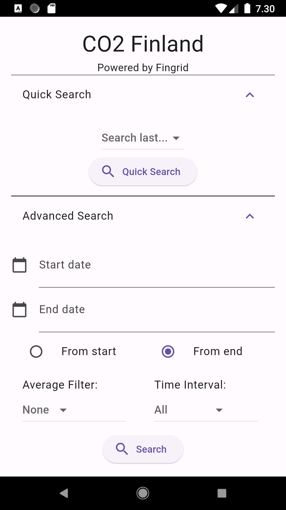
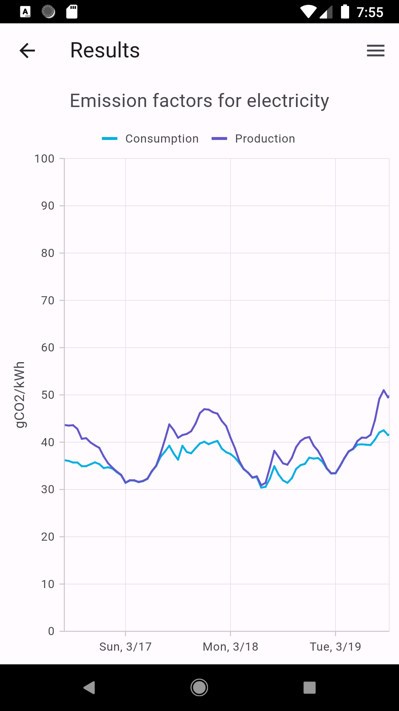
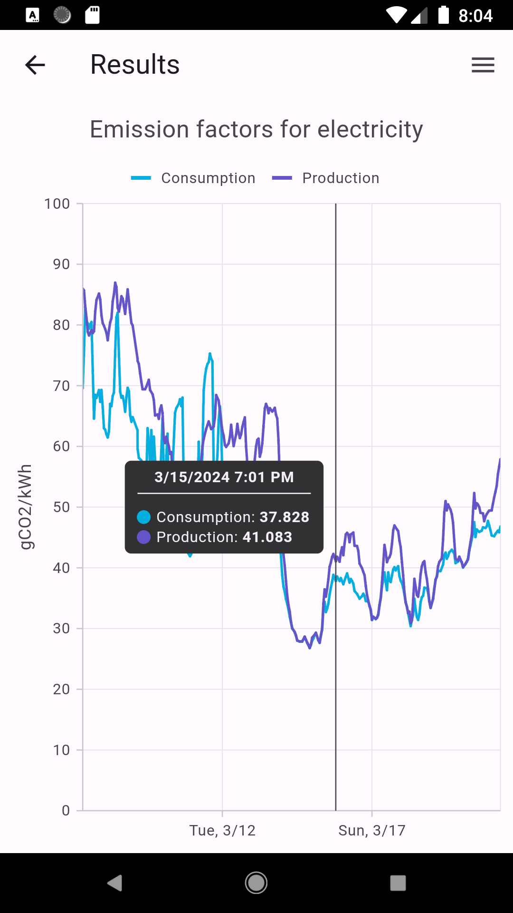
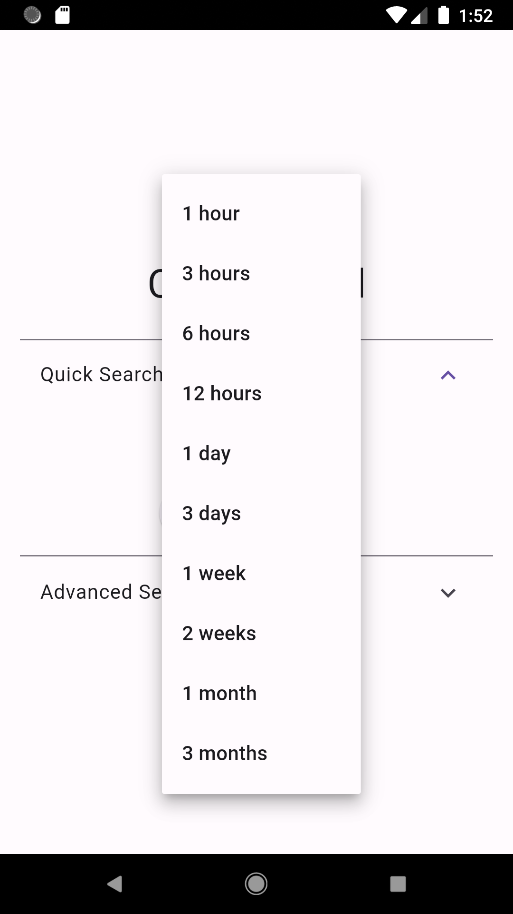
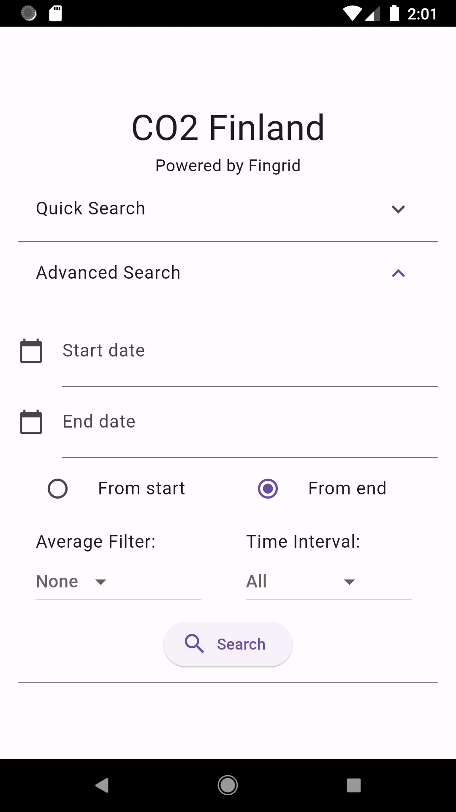

# CO2 Finland
<p align="middle">



</p>

CO2 Finland is a mobile application that shows CO2 emissions of electricity production and consumption from selected timeline in Finland.  
CO2 Finland is programmed using Dart programming language and Flutter framework.  
Fingrid Open Data service is used for data points. (https://data.fingrid.fi/en).  
Syncfusion Flutter Charts is used for drawing charts.  
This project is made by Tomi Isojärvi as a project assignment for Oulu University of Applied Sciences (OAMK).

## How to use
### Search
You can search data using either Quick Search or Advanced Search:
#### Quick Search

Quick Search is a simple search to show the latest data from one hour up to three months ago.

#### Advanced Search

Advanced Search is used for more detailed search.

##### Start date and End date
Select the start date and end date. Select whether you want the data to be shown from the start date or from the end date.

##### Average Filter  
plaa plaa plaa

##### Time interval  


## How to build
### Install Flutter
Visit https://docs.flutter.dev/get-started/install and install Flutter framework for your platform.
### Add the package dependencies to the app
Open the project directory and install package dependencies to the project:
```
cd co2_finland
flutter pub get
```
### Add API key to the project
Visit https://data.fingrid.fi/en to acquire your personal API key. \
\
Create a `.env` file at the project directory and at the following:
```
API_KEY=<YOUR API KEY>
```
At the project directory run the following command:
```
dart run build_runner build -d
```
### Build the project
#### Android
At the project directory run the following command:
```
flutter build apk
```
The created APK file can be found at:
```
co2_finland/build/app/outputs/apk/release/app-release.apk
```
You can install the APK file to a device either manually or by using USB cable. \
To install application using USB cable, use the following command at the project directory:
```
flutter install
```
